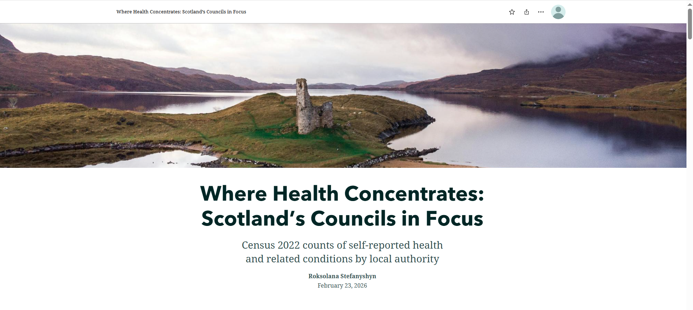
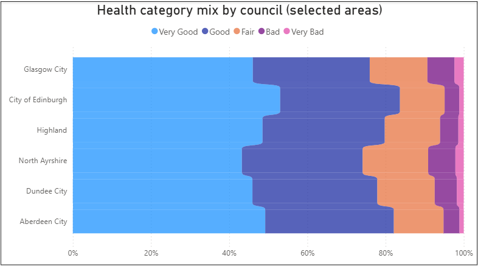

# scotland-health-storymap

# Where Health Concentrates: Scotland’s Councils in Focus

Census 2022 counts of self-reported health and related conditions by local authority.

## Live StoryMap
 **ArcGIS StoryMap:** (https://arcg.is/8X1Kf)

## Preview
### StoryMap cover

### Health category mix (selected councils)

## What this project shows
This project explores how self-reported health responses are distributed across Scotland’s local authorities using **Census 2022** categories:
- Very good
- Good
- Fair
- Bad
- Very bad

It also highlights counts for selected long-term conditions (e.g., long-term illness, physical disability).  
**Note:** These are **counts**, not rates. Larger councils naturally produce larger numbers, so the next step would be to normalise by population and age structure.

## Data sources & credits
- **Data:** Scotland’s Census 2022 (self-reported general health and related conditions), aggregated by local authority.
- **Boundaries:** Scottish local authority boundaries (open data).
- **Mapping:** ArcGIS Online Web Maps + ArcGIS StoryMaps (Esri).
- **Basemap:** Esri (and providers shown in-map).
- **Chart:** Power BI (author’s visualisation).

### Cover image
Add your cover image credit here (/Clément Proust https://www.pexels.com/photo/peninsula-on-a-lake-18661467/).

## Author
Roksolana Stefanyshyn
